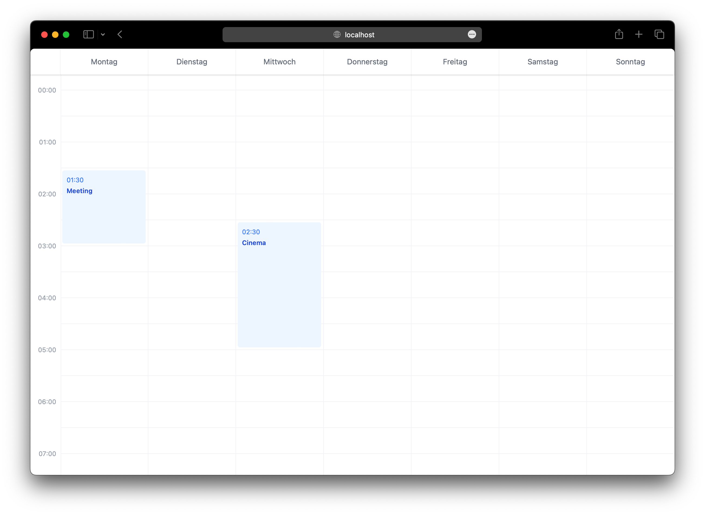

# react-week-calendar

A zero dependency week calendar for React.

## Desktop features

- [ ] Create event
- [ ] Delete event
- [ ] Move event
- [ ] Change week

## Roadmap

- [ ] Touch support
- [ ] Mobile support
- [ ] Cross-day events
- [ ] Overlapping events
- [ ] Localization (first day of week etc.)
- [ ] Custom styles support
- [ ] Remove Tailwind
